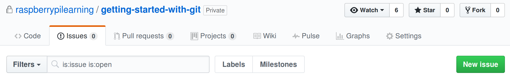

## GitHub issues

Our copy editors at Raspberry Pi are pretty amazing, so the chances of you spotting a typo in this resource are pretty slim. You might spot a mistake in some of the code though, and that's where you can help out. Take this bit of code for example:

```python
print("Hello World!)
```

Let's see how you could help fix this error.

- Head on over to [https://github.com/raspberrypilearning/getting-started-with-git](https://github.com/raspberrypilearning/getting-started-with-git), and make sure you are logged in.

- Now, you want to find the **Issues** tab

	

- You can now create a new issue, and give a description

	

- Once that's completed, the maintainers of the repo will be able to reply to you, and close the issue once it's fixed.

	

