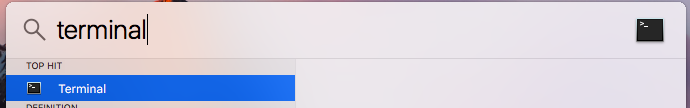
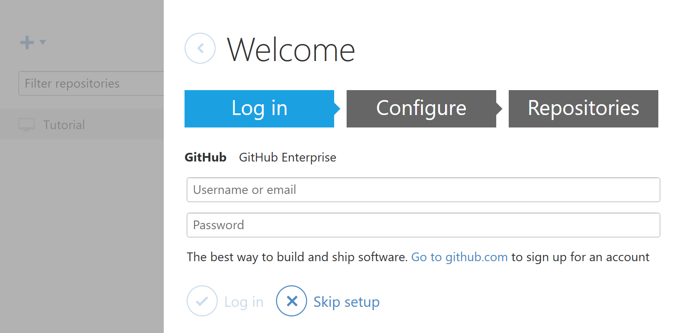
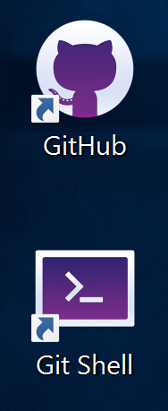

## Getting Git

If you're working on a Raspberry Pi, then congratulations: Git already is installed in Raspbian by default. If you're using Mac OS, then you can follow the collapsed section below to instal Git and then return here to learn how to use it. 

--- collapse ---
---
title: Installing Git on Mac OS
---

Getting Git set up on Mac OS is easy, and has the added benefit of giving you a package manager to install lots of other awesome and open-source software.

1. You're going to need to start by typing a command into a terminal window on Mac OS. This will install the [Homebrew package manager](https://brew.sh/), which is pretty similar to **apt** on Linux.

	

1. Open up a terminal window by typing `Cmd + Space` to open Spotlight and then type `terminal` into the search field.

	
	
1. Now copy and past the following command into the terminal window to install Homebrew.

	```bash
	/usr/bin/ruby -e "$(curl -fsSL https://raw.githubusercontent.com/Homebrew/install/master/install)"
	```
	
	
	
1. You can hit **Return** at the prompts and allow Homebrew to install. Once it is finished, you'll have Git installed on Mac OS, as it's an integral part of Homebrew. You can return to the [main worksheet](worksheet.md), and carry on following the guide.

	
	
1. As an added bonus, you now have an amazing package manager which you can use to install software. For instance, you can install Emacs just by typing `brew install emacs` into a terminal window.
--- /collapse ---

If you're on Windows, then you can follow the collapsed section below to install the Git shell.

--- collapse ---
---
title: Installing Git on Windows
---
The easiest way to install Git on Windows is to use GitHub's application. If you do not already have a GitHub account, you should begin by setting one up, as this will make things easier later on.

1. Register for an account on [GitHub](https://github.com/join?source=header-home), and choose the free plan.

	

1. Head over to [desktop.github.com](https://desktop.github.com/) and click on the **Download** button to download the GitHub app.

	
	
1. Once the file has downloaded, double click on the `.exe` file and follow the onscreen instructions to install. Near the end of the registration, you'll need to use your GitHub credentials to log in, and then proceed through the rest of the steps.

	
	
1. Once the setup has completed, you should see two new icons on your desktop and in your Application menu.

	
	
1. You can use the graphical version of the GitHub app, but if you want to follow the rest of the [worksheet](worksheet.md), you should use the **Git shell** app, which is a command line interface (CLI), to use Git. This way, you'll feel comfortable working on other operating systems, and you will also learn a little Bash (Bourne-again shell).

	
	
1. As the GitHub app has configured your username and email address, you can skip the **Setting up Git** section of the main worksheet.

--- /collapse ---

Lastly, if you're on Linux, and you don't have Git installed, then you can just use your package manager to grab the software. Something like this should work:

```bash
sudo apt install git
```

