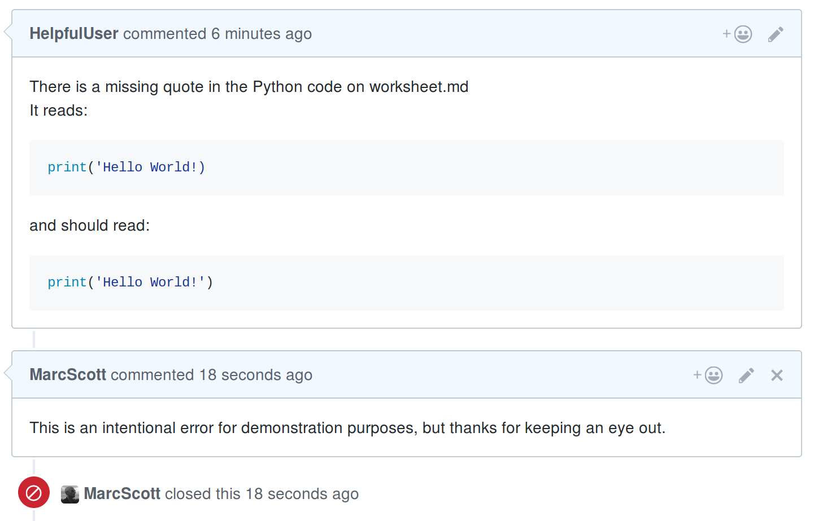

# Getting started with Git

## What is Git?


Git is a version control system (VCS) for tracking changes to files and coordinating changes between multiple people who are all working on the same code base.

One way to think about Git is to imagine a magical school bag. You can pull books out of your bag and do some work whenever you like. Once you've finished your homework, you can put the books back into your school bag, and the bag remembers what changes you made to all the books inside it.

What's really clever is that this school bag can be synchronised with another magical school bag that lives in the clouds. Whenever you like, you can tell the bag to copy the contents of all the books to the sky-bag. If you lose your own school bag, you don't have to worry, as you can just get a new one and grab all the books and writing from the sky-bag.

That's not all though. All your friends at school also have magical school bags. They also keep their bags synchronised with the sky-bag. This means that you and your friends can all work on the homework together. If a friend has a better answer to a science question than you do, you can copy their answer from the sky-bag to your book.

It gets even better than that: your teacher also has a magical school bag. When she wants to check the homework, she just copies all the books from the sky-bag to her bag. She can then check through the answers from the whole class in one go. If she spots a mistake, she can write a comment in the margin of the book, and then all the magical bags from the whole class will have receive the comment. Only one person in the class needs to correct the mistake though, and then everyone in the class immediately has the correct answer.

## Getting Git.

If you're working on a Raspberry Pi, then congratulations: Git already is installed in Raspbian by default. If you're using Mac OS, then you can follow [this quick guide](mac-install.md) to installing Git and then return here to learn how to use it. If you're on Windows, then you can follow [this guide to install Git shell](windows-install.md). Lastly, if you're on Linux, and you don't have Git installed, then you can just use your package manager to grab the software. Something like this should work:

```bash
sudo apt install git
```

## Setting up Git

You're going to be working in a terminal window for the duration of this resource, so open it up by clicking on the icon on the desktop, or by pressing `Ctrl + Alt + T` on your keyboard.

1. The first thing to do is to tell Git who you are. This is important, as Git can be used collaboratively by lots of people, so it needs to know who made changes to which files. You can use your own username and email address, unless you are in fact the Boy Who Lived. 

	```bash
	git config --global user.name "Harry Potter"
	git config --global user.email "h.potter@hogwarts.prof"
	```

1. Next you need to tell Git which text editor you want to use. If you don't have any particularly strong feelings about text editors, then you can just type:

	```bash
	git config --global core.editor nano
	```

## Creating your first magic school bag

So you want to start a new project? Maybe it's a special ultrasonic range finder for tracking flying objects in the air. You'll want a directory on your computer for all your files to sit in, so the first thing to do is create that directory.

1. In the terminal, you can use the `mkdir` (make directory) command to create a new directory.

	```bash
	mkdir snitch-sniffer
	```

1. Now you want to go into that directory. You can use the `cd` (change directory) command to do this.

	```bash
	cd snitch-sniffer
	```

1. Next, you can create a file that will tell people what the project is about. You can use any text editor to do this, but in this example `nano` is used to create a file called `README.md`. The `.md` extension stands for **Markdown**, which is a markup language. You can learn more about Markdown [here](https://daringfireball.net/projects/markdown/).


	```bash
	nano README.md
	```

1. This should open up the file in the terminal. You can now give the file a title and write a short explanation of what your project is about.

	```markdown
	# The Golden Snitch Sniffer
	This is a project that uses multiple long-range ultrasonic sensors to find and track 
	an object flying in three-dimensional space. It displays the object's coordinates, 
	speed, and trajectory through a VR headset.
	```

1. Pressing `Ctrl + X` will cause a save prompt to appear. You can type `Y` to save and then hit `Enter` to close nano.

1. Your file should have been created and will now be sitting in your directory. You can type `ls` in the terminal to see a list of files.

	```bash
	ls
	```

1. At the moment, the directory is just like any other directory on your system. You now need to make the magical school bag part. This is known as a **Git repository**, and it takes the form of a hidden directory that keeps track of all the changes to the working directory. Type the following to create the repository, which from now on will just be called a **repo**:

	```bash
	git init
	```

1. If you type `ls` again, nothing will appear to have changed. You can use `ls -a` to see all the hidden files and directories, though.

	```
	ls -a
	```

1. You should now see something like this in your terminal window:

	```bash
	.  ..  .git  README.md
	```

1. That `.git` directory is the **repo skeleton**. You can have a look inside it by typing the following.

	```bash
	ls -a .git
	```

1. This should bring up something like:

	```bash
	branches  config  description  HEAD  hooks  info  objects  refs
	```

1. You don't really need to worry about this directory at all now. Just know that it is there and that it is tracking all the changes to the parent directory `snitch-sniffer`. 

## Adding your books

1. So you now have the magic school bag part, but you haven't yet added anything to it. That `README.md` file hasn't been placed into the bag yet. You need to tell Git that you want to add the `README.md` file to the repo. To do this you can simply type:

	```bash
	git add README.md
	```

	Sometime it's easier to just add everything to the repo though, rather than adding individual files. To do this you can type:

	```bash
	git add --all
	```

1. Now Git knows it needs to keep track of all the changes that happen to the `README.md` file. You can have a look at the status of your repo at any time by typing the following: 

	```bash
	git status
	```

	You should see something like this

	```bash
	On branch master

	Initial commit

	Changes to be committed:
	  (use "git rm --cached <file>..." to unstage)

		new file:   README.md
	```

1. The above response is telling you that the `README.md` file has not yet been **committed**. This means that although Git knows about the file, it doesn't yet have any of the file's contents stored. The simplest way to do a commit is by typing:

	```bash
	git commit -am 'add README.md'
	```

	This commits all changes you have made in the directory to the Git repo, and adds a message saying what you did. The message can be anything really, but it's best to keep it fairly short yet descriptive of what you changed.

## Adding more books and travelling in time.

1. Now that you have set up your repo, it's time to get on with the project. Here, two new files have been created: `snitch-sniffer.py` and `quidditch-rules.json`. Typing `ls` reveals those files.

	```bash
	README.md  quidditch-rules.json  snitch-sniffer.py
	```

1. The new files need to be added to the Git repo and then committed.

	```bash
	git add --all
	git commit -am 'add json rules and python program'
	```

1. Then you carry on working on your code for a bit. Every time you make a significant change to the file, you can perform a new commit.

	```bash
	git commit -am 'finish find function'
	```

1. Now imagine that you've made a horrible mistake. You've been working for a while and you've deleted your `find_snitch()` function, and then performed a commit. With Git, it's easy to go back in time and restore an earlier version of any of your files. Let's first look at the commit history of the file.

	```bash
	git log snitch-sniffer.py
	```

1. This produces something like this:

	```bash
	commit 12c4c693e95438ceadcf3f4fb39c83ce1ade712f
	Author: Harry Potter <h.potter@hogwarts.prog>
	Date:   Fri Mar 3 20:27:17 2017 +0000

		delete find function

	commit 5fd772a292c019a7cf3012b1156685280d4a7d2d
	Author: Harry Potter <h.potter@hogwarts.prog>
	Date:   Fri Mar 3 20:24:52 2017 +0000

		finish find function

	commit 127545c19794b5fe869dd22d0cf57bf8820c5794
	Author: Harry Potter <h.potter@hogwarts.prog>
	Date:   Fri Mar 3 20:20:18 2017 +0000

		add json rules and python program
	```

1. You can see that in that last commit (the one at the top) was where the function was deleted. Luckily the commit message has made it easy to see what was done, which is why commit messages are important. However, typing `git log -p snitch-sniffer.py` would have actually shown the changed contents of the file, if the commit message wasn't clear enough.

1. You can now get back the version of the file from the commit before. The long string of characters after the word 'commit' is called a hash, and is used by Git to keep track of files. In this case, the commit that needs to be restored is `5fd772a292c019a7cf3012b1156685280d4a7d2d`. So typing the following will get the file back to the way it was:

	```bash
	git checkout 5fd772a292c019a7cf3012b1156685280d4a7d2d snitch-sniffer.py
	```

1. The file will be restored and you can now commit this change.

	```bash
	git commit -am 'restore find function'
	```

## Making major changes

Imagine you're talking to your friend about your amazing project, and they have a really cool idea for some changes you could make to improve it. Your friend suggests using [Lidar](https://en.wikipedia.org/wiki/Lidar) rather than ultrasonic sensors. The changes are quite large, though, and you're worried that if you make them, you might break the project. You could make a copy of the directory and start working on this copy, but to keep using Git you'd have to make an entirely new repo. This could all get quite confusing. Luckily, Git has a feature called **branches**; using a branch allows you to make copies without losing or altering your original work.

1. First, you can have a look at your repo's current status.

	```bash
	git status
	```

	This should show something like this:

	```bash
	On branch master
	nothing to commit, working directory clean
	```

1. Now you can make a new branch in the repo, which lets you work on your amazing new adaption.

	```bash
	git checkout -b lidar-version
	```

1. Now `git status` will show you something like this:

	```bash
	On branch lidar-version
	nothing to commit, working directory clean
	```

	This tells you that you are on the `lidar-version` branch. To view all the branches in your repo, you can type `git branch` which will show something like this:

	```bash
	* lidar-version
		master
	```

1. You can now work on the lidar-version branch without altering your master branch. If you try out the new approach and find it doesn't work, you can simply delete the branch using `git branch -D lidar-version`. However, if it all works well, you can merge the branch back into your master branch.

1. First, you'll need to make sure all your changes are committed and then switch back to the master branch.

	```bash
	git checkout master
	```
1. Then you can merge the version into the master branch

	```bash
	git merge lidar-version
	```
1. **Warning**: you can cause problems with a merge if you're working on two branches at the same time, as Git won't know which changes are the ones you want to keep. For this reason, it's best to just work on one branch at a time.

## Working with a sky-bag

Now that you know how to do the basics in Git, it's time to learn how to use it to its full potential: use it to share your work and collaborate with others.

There are lots of services that will host your Git repo for you, free of charge. [GitLab](https://about.gitlab.com/) is one such service and [BitBucket](https://bitbucket.org/) is another. In this resource, you are going to be using [GitHub](https://github.com/), which is one of the more popular services.

1. The first thing to do is to register for an account on [GitHub](https://github.com/join?source=header-home), and just choose the free plan.

	

1. Now that you have an account, you can create a `snitch-sniffer` repo on GitHub. Find the **New repository** button and click it.

	

1. Give the repo a name and a description and click on the **Create repository** button

	

1. This should then bring up a page of instructions

	

1. As you already have a repo ready to push to GitHub, then all you need to do is make sure you are in your project directory and type:

	```bash
	git remote add origin git@github.com:HarryPotter/snitch-sniffer.git
	```

	and then

	```bash
	git push -u origin master
	```

1. If you look on GitHub, you should now be able to see your repo, along with the displayed `README.md` file that you wrote.

	

1. Any time you make changes to your project, and you want to push them up to GitHub, you can just type:

	```bash
	git push origin master
	```

	If you are working on a different branch you would type:

	```bash
	git push origin <branch-name>
	```

## Collaborative working

The true power of services like GitHub becomes apparent when you start working with other people. GitHub lets other people make their own copies of your projects, or you to make copies of theirs. Either of you can then make improvements to the project and then push the improvements up to GitHub for everyone to share.

This resource is itself a GitHub repo. You can find it at [https://github.com/raspberrypilearning/getting-started-with-git](https://github.com/raspberrypilearning/getting-started-with-git). That means that if you found a mistake in the resource, or if you just wanted to make some improvements, you can. There are two main ways to get involved with other people's projects: **issues** and **pull requests**.

## GitHub issues

Our copy editors at Raspberry Pi are pretty amazing, so the chances of you spotting a typo in this resource are pretty slim. You might spot a mistake in some of the code though, and that's where you can help out. Take this bit of code for example:

```python
print("Hello World!)
```

Let's see how you could help fix this error.

1. Head on over to [https://github.com/raspberrypilearning/getting-started-with-git](https://github.com/raspberrypilearning/getting-started-with-git), and make sure you are logged in.

1. Now, you want to find the **Issues** tab

	

1. You can now create a new issue, and give a description

	

1. Once that's completed, the maintainers of the repo will be able to reply to you, and close the issue once it's fixed.

	

## Pull requests

Issues are great, but if you want to help out even more, then project maintainers are usually very happy for you to fix or improve projects yourself. To do this, you need to make your own copy of the repo so that you can work on it.

1. On the projects main page, find the **Fork** button, and click it.

	

1. You will now have a copy of the repo. You should see a **Clone or download** button. Clicking this will reveal the uniform resource identifier (URI) of the repo. Now, using the terminal, you can clone the repo to your computer with `git clone`:

	```bash
	git clone https://github.com/HelpfulUser/getting-started-with-git.git
	```

1. All the files and directories will now be on your computer. Go ahead and make the changes you want, then commit them and push them back up to GitHub, just like you would normally do. Here your commit message is particularly important, as it will explain the changes you have made to the resource's original owner.

1. You can now head back over to GitHub. Find the button that says **New pull request**.

	

1. Click the button and then click on the **Create pull request** button.

	

1. Your commit message will be there, but you can change it and even add a more detailed description if you like.

	

1. Once you're happy, click the **Create pull request** button. The maintainer of the repo will then be able to see your pull request. They can then choose to merge it into their repo, or close it.

	

## What next?

1. Now that you have an understanding of the way Git and GitHub works, you could start using it for all your projects.

1. When you create a project, don't forget to tell people about it, and send them links to your GitHub repos. That way they can use your code and maybe even help to make it better.

1. Why not find a project that you could help out with on GitHub? You can help with anything from improving the code and the documentation to fixing little typos.
